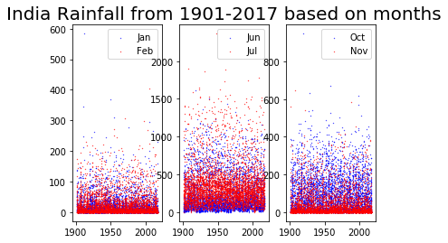
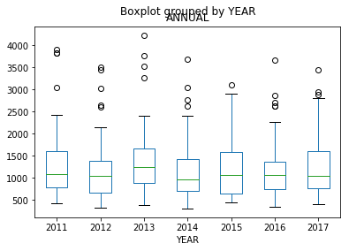
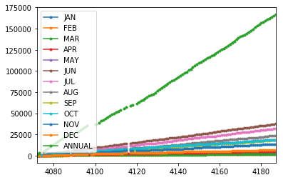
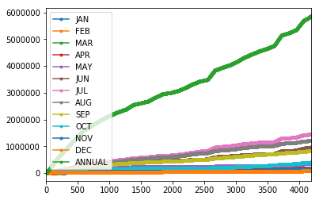

# Research Method (DS200)

This repository is dedicated to the Module 4 of the DS200.

## Environment used
1. Python 3 is used for completing this assignment.
2. All experiments are performed in the google colab and can be regenerated.
3. Libraries used: pandas, numpy, matplotlib.

## How to run
1. Download the zipfile and run ResearchMethod_M4.ipynb on google colab or jupyter notebook and there is also a python researchmethod_m4.py file available.

## Dataset 
The data is also available publicly at <https://data.gov.in>. This is the Rainfall data from 1901-2017 based on states, months and annually and all the pllots are made using this dataset. 

## Sub Divisional Monthly Rainfall from 1901 to 2017 in India

**a. Scatter Plot**

**Observation:** The scatter plot above shows the comparision between the different season of months based on the amount of rainfall. So we can easily conclude that June and July month have more rain than other.

**b. Box Plot**

**Observation:**  This plot show the annual rainfall in india from the year 2011 to 2017 and how it's varies across different regions. The observation is the average annual rainfall is almost same but their are few outliers having low and high rain in a region.

**c.1 Line Plot**

**Observation:** The line plot shows the cumulative line plot for the Lakshadweep Union territory from 1901 to 2017 and it is observed that July have the most rainfall and Feburary have the least in the territory.

**c.2 Line Plot**

**Observation:** The line plot shows the cumulative line plot for the Lakshadweep Union territory from 1901 to 2017 and it is observed that July have the most rainfall and Feburary have the least in the territory.

## Citations

1. R&D Expenditure Per Capita and as Percentage of GDP for Selected Countries 2009 (in US$)  
Source : UIS, UNESCO (Website accessed on 11 August, 2013); World Development Indicators, The World Bank; * OECD Main S&T Indicators vol. 2011/2; Note: 1. # 2008; 2. % Estimate based on 2009-10 exchange rate, Economic Survey 2010-11.

2. GDP of India and major Sectors of Economy, Share of each sector to GDP and Growth rate of GDP and other sectors of economy 1951-52 onward  
Source : CSO
## Authors

* **Billie Thompson** - *Initial work* - [PurpleBooth](https://github.com/PurpleBooth)

See also the list of [contributors](https://github.com/your/project/contributors) who participated in this project.

## License

This project is licensed under the MIT License - see the [LICENSE.md](LICENSE.md) file for details

## Acknowledgments

* Hat tip to anyone whose code was used
* Inspiration
* etc
